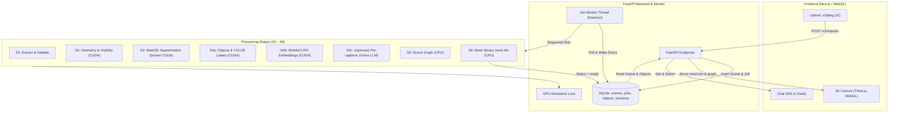

# Kiến trúc Hệ thống & Quy trình Xử lý Scene (S3D Pipeline)

Tài liệu này mô tả chi tiết kiến trúc bên trong, quy trình xử lý Scene (Scene Processing Pipeline), phân tích chi tiết từng công đoạn từ S1 đến S6, và các chức năng tương tác của người dùng cuối trong hệ thống S3D.

---

## 1. Kiến trúc Hệ thống & Cơ chế Vận hành Cốt lõi

S3D được thiết kế theo kiến trúc **Local-first, Single-user**, tối ưu hóa cho môi trường tính toán máy tính cá nhân/máy trạm có bộ nhớ đồ họa (VRAM) giới hạn (~6 GiB như NVIDIA RTX 3050).



### Các nguyên lý kiến trúc quan trọng:
1. **Durable Job Worker & Event Polling**:
   - Khi người dùng tải lên Package `.s3dpkg`, API lưu bản ghi Scene và Job ở trạng thái `queued` trong SQLite, sau đó kích hoạt tín hiệu `WAKE` (`threading.Event`).
   - Một Daemon Thread chạy nền (`s3d-job-worker`) nhận diện job và lần lượt chạy tuần tự các công đoạn. Nếu máy bị tắt hoặc tiến trình dừng đột ngột, khi khởi động lại worker sẽ tự động khôi phục và chạy tiếp.
2. **GPU Admission Lock & Thu hồi VRAM triệt để**:
   - Tất cả tác vụ GPU dùng chung một khóa điều phối (`GPU.reserve(...)`).
   - Trước khi bất kỳ stage GPU nào được chạy (Mask3D, YOLOE, MobileCLIP2), hệ thống giải phóng toàn bộ mô hình ngôn ngữ lớn (Llama/Qwen) khỏi bộ nhớ đồ họa qua `unload_llm()`.
   - Các công đoạn tính toán nặng được chạy trong **tiến trình con độc lập (`subprocess`)**. Khi tiến trình con kết thúc, hệ điều hành tự động giải phóng 100% VRAM và RAM, tránh hiện tượng phân mảnh bộ nhớ CUDA.
3. **An toàn dữ liệu & Ghi nguyên tử (Atomic Replace)**:
   - Dữ liệu đầu ra của mỗi bước được ghi vào thư mục tạm có hậu tố `.partial`.
   - Chỉ khi toàn bộ bước hoàn tất thành công, tệp/thư mục mới được đổi tên nguyên tử (`atomic replace`), đảm bảo không để lại dữ liệu dở dang hoặc bị hỏng khi gặp sự cố.

---

## 2. Chi tiết Quy trình Xử lý Scene (S1 $\rightarrow$ S6)

```text
Upload (.s3dpkg) 
  ──> [S1] Trích xuất & Xác thực package
  ──> [S2] Nhận diện sàn/tường (RANSAC) & Tính ma trận tầm nhìn (Visibility)
  ──> [S3] Phân đoạn 3D đám mây điểm (Mask3D)
  ──> [S4a] Đo kích thước/màu sắc & Bỏ phiếu nhãn đa góc nhìn (YOLOE)
  ──> [S4b] Trích xuất vector nhúng đặc trưng (MobileCLIP2 + RoFA)
  ──> (S4c tùy chọn) Mô tả ngôn ngữ thị giác (Pre-captioning)
  ──> [S5] Xây dựng đồ thị không gian ngữ nghĩa (Scene Graph)
  ──> [S6] Đóng gói lưới nhị phân cho WebGL (mesh.bin)
  ──> Hoàn thành: Scene chuyển trạng thái "ready"
```

---

### BƯỚC S1: Giải nén & Xác thực Package (`load_package`)

* **Vì sao có bước này?**
  Ứng dụng hoạt động theo mô hình cô lập dữ liệu. File `.s3dpkg` người dùng tải lên là một kho lưu trữ dạng tar nén chứa toàn bộ dữ liệu quét (mesh, ảnh màu, ảnh độ sâu, poses camera, ma trận nội suy). S1 đảm bảo file này toàn vẹn, hợp lệ về mặt cấu trúc trước khi cho phép hệ thống tốn tài nguyên xử lý.
* **Cách hoạt động bên trong:**
  - Xác thực manifest theo hợp đồng `s3dpkg/2` (phiên bản định dạng, ma trận căn chỉnh `axisAlignment` đã được áp dụng ở khâu prep bên ngoài).
  - Giải nén an toàn vào thư mục tạm `S1/<config_hash>.partial`, kiểm tra ngăn chặn tấn công Path Traversal.
  - Kiểm tra đầy đủ các tệp cần thiết: `mesh/vh_clean_2.ply`, `mesh/superpoints.npy`, `calib/intrinsics.json`, và các cặp ảnh `frames/color/*.jpg`, `frames/depth/*.png`, `frames/pose/*.txt`.
  - Đổi tên thư mục thành công và tạo `complete.json`.
* **Input & Output:**
  - **Input:** File nén tar `.s3dpkg` (v2).
  - **Output:** Thư mục `S1/` chứa các tệp đã giải nén có cấu trúc chuẩn hóa và `complete.json`.
* **Nếu không có bước này thì sao?**
  Hệ thống không thể đọc được dữ liệu thô bị nén; nếu file hỏng hoặc chứa đường dẫn độc hại (`../`), server sẽ bị crash hoặc dính lỗ hổng bảo mật truy cập tệp tùy ý.

---

### BƯỚC S2: Phân tích Hình học & Tầm nhìn (`run_geometry`)

* **Vì sao có bước này?**
  Để sau này AI có thể định vị không gian (ví dụ: *"vật thể nào nằm trên sàn"*, *"cái nào cạnh tường"*) và liên kết một điểm 3D với ảnh 2D (biết camera nào nhìn thấy đỉnh 3D nào), hệ thống bắt buộc phải tính toán các mặt phẳng cấu trúc và ma trận tầm nhìn (visibility map).
* **Cách hoạt động bên trong:**
  1. **Nhận diện Cấu trúc sàn/tường (Axis-constrained RANSAC)**:
     - Lấy mẫu các điểm ở tầng thấp ($Z \le 30\%$) để tìm mặt phẳng ngang consensus có mật độ lớn nhất $\rightarrow$ Xác định chính xác mặt sàn (`floor`).
     - Lọc các điểm phía trên sàn ($> 20\text{ cm}$) để tìm tiếp tối đa 4 mặt phẳng thẳng đứng có diện tích lớn $\rightarrow$ Xác định các bức tường (`wall-1` đến `wall-4`).
  2. **Chiếu kiểm tra độ sâu trên GPU (Depth-tested Visibility)**:
     - Dùng PyTorch trên GPU: với từng khung hình camera, chiếu tọa độ các đỉnh lưới $X, Y, Z$ vào mặt phẳng ảnh $u, v$ theo ma trận nội suy `intrinsic` và ngoại suy `pose`.
     - So sánh khoảng cách $Z_{\text{camera}}$ với giá trị độ sâu quan sát được từ ảnh `depth.png`. Nếu chênh lệch $< 0.1\text{ m}$ (nghĩa là điểm đó không bị vật thể khác che khuất), ghi nhận đỉnh đó **được nhìn thấy bởi frame này**.
* **Input & Output:**
  - **Input:** `S1/mesh/vh_clean_2.ply`, `S1/frames/depth/*.png`, `S1/frames/pose/*.txt`, `calib/intrinsics.json`.
  - **Output:**
    - `S2/structures.json`: Danh sách các mặt phẳng sàn và tường (pháp tuyến, độ lệch offset, bounding box, số lượng đỉnh).
    - `S2/geometry.npz`: Mảng tọa độ đỉnh, mảng `visibility_indices` và `visibility_offsets` (chỉ số các đỉnh nhìn thấy theo từng frame).
    - `S2/metrics.json`: Bộ nhớ VRAM GPU đã sử dụng.
* **Nếu không có bước này thì sao?**
  - Không thể biết vật thể nào nằm trên sàn hay gắn vào tường trong đồ thị không gian.
  - Không thể biết ảnh chụp camera nào nhìn thấy vật thể nào $\rightarrow$ Không thể cắt ảnh 2D để đưa vào mô hình nhận diện YOLOE/MobileCLIP ở các bước sau.

---

### BƯỚC S3: Phân đoạn Cá thể 3D (`run_instances` - Mask3D)

* **Vì sao có bước này?**
  Lưới scan 3D ban đầu chỉ là một tập hợp hàng trăm nghìn đỉnh vô tri giác. Bước này nhận diện và gom các cụm đỉnh lại thành từng **vật thể riêng biệt (Instances)** trong không gian 3 chiều (ví dụ: đâu là cái ghế A, đâu là cái ghế B, đâu là cái giường).
* **Cách hoạt động bên trong:**
  - Ứng dụng gọi sang service riêng biệt chạy bằng Docker CUDA `http://mask3d:9000/run`.
  - Mô hình **Mask3D** sử dụng kiến trúc tích chập thưa (Sparse Convolution via MinkowskiEngine) trên đám mây điểm đã được voxel hóa ($0.03\text{ m}$).
  - Mạng dự đoán mặt nạ phân đoạn 3D cho từng vật thể dựa trên tập dữ liệu ScanNet200, gán cho mỗi đỉnh lưới 3D một `instance_id` (từ $0, 1, 2...$, các điểm không thuộc vật thể nào mang giá trị $-1$).
* **Input & Output:**
  - **Input:** File lưới `S1/mesh/vh_clean_2.ply`.
  - **Output:**
    - `S3/masks.npz`: Chứa mảng `instance_ids` (độ dài bằng đúng số lượng đỉnh của lưới PLY), nhãn sơ bộ `labels`, và độ tin cậy `confidences`.
    - `S3/masks.json`: Báo cáo số lượng proposal và thời gian chạy.
* **Nếu không có bước này thì sao?**
  Hệ thống hoàn toàn không có khái niệm "vật thể 3D" (Object). Người dùng không thể click chọn từng vật thể trên màn hình, và AI không thể đếm hay phân biệt các đồ vật trong phòng.

---

### BƯỚC S4a: Đo lường Vật thể & Bỏ phiếu Nhãn đa góc nhìn (`run_semantics: labels`)

* **Vì sao có bước này?**
  Mặc dù Mask3D đã phân cụm được các đỉnh của vật thể, việc gán nhãn chỉ dựa trên đám mây điểm 3D thưa thường kém chính xác hơn việc kết hợp ảnh chụp 2D độ phân giải cao. S4a kết hợp hình học 3D với mô hình nhận diện 2D (YOLOE) trên nhiều góc chụp để đưa ra nhãn chính xác nhất.
* **Cách hoạt động bên trong:**
  1. **Đo đạc hình học & Màu sắc (Objects Measurement)**:
     - Tính tâm đối xứng (`center`: $[x, y, z]$), kích thước hộp bao 3D (`size`: $[dx, dy, dz]$), số lượng đỉnh (`vertices`).
     - Phân tích màu sắc: Chuyển đổi RGB của các đỉnh sang không gian màu HSV, bỏ phiếu theo histogram màu để xác định tên màu chủ đạo (`dominant_color`: red, brown, black, white...) và mẫu RGB đại diện.
     - Dựa vào `visibility_offsets` từ S2, tìm ra **Top 5 Keyframes** chụp rõ vật thể đó nhất.
  2. **Bỏ phiếu nhãn đa góc nhìn (Multi-view YOLOE Voting)**:
     - Chạy mô hình YOLOE trên các frame ảnh 2D tương ứng.
     - Cắt vùng crop bao quanh vật thể được chiếu lên ảnh 2D.
     - Gom tất cả các nhãn dự đoán từ nhiều góc chụp, tính trọng số theo độ phủ (coverage) và độ tin cậy (confidence) để chọn ra nhãn tối ưu (`label`) cùng các nhãn thay thế (`alt_labels`).
  3. Lưu thông tin vật thể hoàn chỉnh vào bảng `objects` trong cơ sở dữ liệu SQLite.
* **Input & Output:**
  - **Input:** `S1/mesh/vh_clean_2.ply`, `S2/geometry.npz`, `S3/masks.npz`, ảnh `S1/frames/color/*.jpg`.
  - **Output:**
    - `S4/objects.json`: Danh sách đối tượng đầy đủ (ID, nhãn, độ tin cậy, tâm, kích thước, màu sắc, danh sách keyframes).
    - Cập nhật các hàng vào bảng `objects` trong SQLite.
* **Nếu không có bước này thì sao?**
  Các vật thể sẽ không có thông tin kích thước, tọa độ tâm, màu sắc trực quan, và nhãn nhận diện sẽ rất nghèo nàn/kém chính xác; không thể hiển thị bảng Objects Panel ở frontend.

---

### BƯỚC S4b: Trích xuất Vector Nhúng Đa góc nhìn (`run_semantics: embeddings`)

* **Vì sao có bước này?**
  Khi người dùng tìm kiếm bằng từ ngữ tự nhiên hoặc những mô tả không trùng khớp chính xác 100% với nhãn (ví dụ: người dùng hỏi *"comfy recliner"* nhưng nhãn là *"armchair"*), hệ thống cần một vector đặc trưng ngữ nghĩa thị giác (Visual-Semantic Embedding) để tìm kiếm tương đồng (Semantic Search / Lookup).
* **Cách hoạt động bên trong:**
  - Lấy các vùng crop ảnh 2D của vật thể từ các Keyframe tốt nhất.
  - Đưa qua mô hình **MobileCLIP2** (mạng thị giác gọn nhẹ chạy GPU) để trích xuất vector đặc trưng thị giác 512 chiều cho từng góc nhìn.
  - Sử dụng thuật toán **RoFA (Robust Outlier-Filtered Averaging)**:
    - Chuẩn hóa các vector về độ dài đơn vị.
    - Tính vector trung bình và độ lệch chuẩn của các góc nhìn.
    - Loại bỏ các góc nhìn ngoại lai (bị nhiễu, bị che khuất) rồi tính trung bình có trọng số của các vector hợp lệ còn lại để tạo ra **1 vector embedding đại diện duy nhất** cho vật thể.
  - Cập nhật trường `embedding` trong SQLite.
* **Input & Output:**
  - **Input:** `S4/objects.json`, ảnh crop từ `S1/frames/color/*.jpg`.
  - **Output:**
    - `S4/embeddings.npz`: Chứa ma trận vector nhúng kích thước $[N_{\text{objects}}, 512]$.
    - `S4/embeddings.metrics.json`: Thông số đo lường.
* **Nếu không có bước này thì sao?**
  Hệ thống mất khả năng tìm kiếm tương đồng ngữ nghĩa (Semantic Lookup). Nếu người dùng dùng từ đồng nghĩa hoặc câu chữ miêu tả ngoại hình không trùng với từ điển nhãn cố định thì hệ thống sẽ không tìm thấy vật thể.

---

### BƯỚC S4c (Tùy chọn): Sinh Mô tả Chi tiết (`precaption` - Vision LLM)

* **Vì sao có bước này?**
  *(Mặc định tắt hoặc cấu hình qua `S3D_CAPTIONS_TOP_N`)*. Dành cho các vật thể trung tâm, quan trọng nhất trong phòng (như giường ngủ, bàn làm việc lớn) cần mô tả phong phú chi tiết bằng lời văn để hỗ trợ giải thích sâu.
* **Cách hoạt động bên trong:**
  - Chọn $N$ vật thể có số lượng đỉnh lớn nhất.
  - Đưa 2 ảnh Keyframe tốt nhất của từng vật thể vào Vision-Language Model để sinh câu miêu tả ngữ cảnh (caption).
* **Input & Output:**
  - **Input:** $N$ vật thể lớn nhất và ảnh Keyframe.
  - **Output:** Ghi trường `caption` vào bản ghi của vật thể trong SQLite.
* **Nếu không có bước này thì sao?**
  Không ảnh hưởng đến các chức năng cơ bản. Nếu câu hỏi yêu cầu giải thích sâu bằng thị giác, hệ thống sẽ gọi Vision model lúc truy vấn (on-demand / lazy evaluation) thay vì sinh trước.

---

### BƯỚC S5: Xây dựng Đồ thị Cảnh Ngữ nghĩa (`run_module: graph_stage`)

* **Vì sao có bước này?**
  Để trả lời các câu hỏi về quan hệ không gian (ví dụ: *"chiếc ghế ở bên phải cái bàn"*, *"cốc nước trên bàn"*, *"bức tranh treo trên tường"*), máy tính không thể chỉ nhìn tọa độ rời rạc mà cần một mạng lưới quan hệ rõ ràng (Scene Graph).
* **Cách hoạt động bên trong:**
  - Đọc danh sách vật thể từ `S4/objects.json` và cấu trúc sàn/tường từ `S2/structures.json`.
  - Tính toán các quan hệ không gian tất định hình học 3D (Deterministic 3D Predicates):
    - **`ON_TOP_OF` / `SUPPORTED_BY`**: Kiểm tra hình chiếu $XY$ chồng lấn và đáy của vật thể A tiếp xúc với đỉnh của vật thể B (hoặc mặt sàn).
    - **`NEXT_TO` / `NEAR`**: Khoảng cách biên Euclidean giữa 2 bounding box nhỏ hơn ngưỡng cho phép.
    - **`AGAINST_WALL`**: Bounding box của vật thể áp sát vào mặt phẳng tường tìm được ở S2.
    - **`CONTAINS` / `INSIDE`**: Hộp bao của vật thể này nằm lọt trong hộp bao vật thể kia.
  - Xuất ra đồ thị có hướng (Directed Graph) chứa các nút (Objects, Structures) và các cạnh (Predicates/Relations).
* **Input & Output:**
  - **Input:** `S4/objects.json` và `S2/structures.json`.
  - **Output:** `S5/graph.json`: Chứa danh sách các đỉnh (`nodes`) và các cạnh quan hệ (`relations`).
* **Nếu không có bước này thì sao?**
  - Không hiển thị được mục **Spatial Relations** trong bảng chi tiết vật thể ở UI.
  - Bộ giải toán không gian (**Solver**) không thể xử lý các câu truy vấn phức tạp dạng lồng ghép quan hệ (như *"the chair next to the table on the left"*).

---

### BƯỚC S6: Đóng gói Lưới Nhị phân cho WebGL (`publish_mesh`)

* **Vì sao có bước này?**
  Tệp lưới quét gốc `.ply` thường có kích thước rất lớn (hàng chục đến hàng trăm MB), định dạng text hoặc nhị phân phức tạp, chưa tích hợp sẵn `instance_id` cho từng đỉnh. Trình duyệt tải file PLY sẽ rất chậm và tốn RAM để parse. S6 chuyển đổi toàn bộ thành một file nhị phân nhỏ gọn, chuẩn hóa, nạp trực tiếp vào GPU trình duyệt cực nhanh.
* **Cách hoạt động bên trong:**
  - Đọc các đỉnh $X, Y, Z$ (float32) và màu sắc RGB (uint8) từ PLY.
  - Chuyển đổi các mặt đa giác thành mảng tam giác (`indices` uint32).
  - Tích hợp mảng `instance_ids` (int32) từ file `S3/masks.npz` (mỗi đỉnh mang đúng ID của vật thể sở hữu nó, hoặc $-1$ nếu là nền).
  - Đóng gói thành định dạng nhị phân độc quyền chuẩn hóa `S3DM`:
    - Header: Magic byte `S3DM`, phiên bản `1`, số đỉnh $N_v$, số chỉ số tam giác $N_i$.
    - Buffer 1: $N_v \times 12\text{ bytes}$ (tọa độ $X, Y, Z$).
    - Buffer 2: $N_v \times 3\text{ bytes}$ (màu $R, G, B$).
    - Buffer 3: $N_i \times 4\text{ bytes}$ (tam giác indices).
    - Buffer 4: $N_v \times 4\text{ bytes}$ (mảng `instance_id`).
  - Ghi file nguyên tử ra `S6/mesh.bin`.
* **Input & Output:**
  - **Input:** `S1/mesh/vh_clean_2.ply` và `S3/masks.npz`.
  - **Output:** `S6/mesh.bin` (tệp nhị phân nạp nhanh cho Three.js).
* **Nếu không có bước này thì sao?**
  Frontend WebGL/Three.js không thể tải được mô hình 3D, không thể render phòng, không thể thực hiện tương tác click chọn vật thể và shader highlight.

---

## 3. Kết quả Khi Hoàn thành Toàn bộ Quá trình

Sau khi bước S6 kết thúc thành công:
1. Bản ghi `jobs` trong SQLite được cập nhật sang `status = 'complete'`.
2. Bản ghi `scenes` được cập nhật sang `status = 'ready'`.
3. Bảng `stage_runs` lưu lại đầy đủ nhật ký thời gian chạy (seconds) và dung lượng VRAM đỉnh của từng bước.

### Các Chức Năng Người Dùng Cuối Tương Tác:

| Khu vực | Chức năng cụ thể |
| :--- | :--- |
| **Quản lý Scene (Trang chủ `/`)** | • Xem danh sách và trạng thái các Scene.<br>• Mở Scene vào không gian 3D (`Open mesh →`).<br>• Tái xử lý (`Reprocess`) từ bất kỳ bước nào (S1 đến S6).<br>• Xóa Scene (`Delete`) có tùy chọn giữ lại hoặc xóa file package gốc.<br>• Xác nhận ghi đè (`Replace`) khi upload trùng mã Scene. |
| **Trình xem 3D (3D Canvas)** | • Xoay, thu phóng, di chuyển góc nhìn (OrbitControls).<br>• Click picking chọn vật thể trực tiếp trên bề mặt lưới 3D.<br>• Camera tự động căn chỉnh và bay mượt mà tới tâm vật thể.<br>• Bounding box khung dây màu vàng bao quanh vật thể được chọn.<br>• Shader Dimming: Làm mờ toàn bộ phòng, chỉ làm nổi bật vật thể được chọn.<br>• Bật/Tắt hiển thị cấu trúc sàn (`floor` màu vàng cam) và tường (`wall` màu xanh ngọc). |
| **Bảng Vật thể (Objects Panel)** | • Thống kê tổng số lượng vật thể.<br>• Tìm kiếm / lọc tức thì theo tên nhãn tiếng Anh.<br>• Thẻ vật thể: mã màu swatch, nhãn, ID, % độ tin cậy, tên màu.<br>• Chi tiết số đỉnh (vertices), kích thước dài $\times$ rộng $\times$ cao.<br>• Liệt kê quan hệ không gian (`Spatial Relations`) từ Scene Graph và click để chuyển nhanh góc nhìn tới vật thể liên quan. |
| **Hỏi đáp AI Không gian (ChatPanel)** | • Nhập câu hỏi tự nhiên bằng tiếng Anh (tìm kiếm, đếm, xác định vị trí).<br>• Tự động truyền góc nhìn camera thời gian thực (`Viewpoint`) để trả lời câu hỏi tương đối (như "to my left", "in front of me").<br>• Truyền ngữ cảnh vật thể đang chọn (`selected_object_id`).<br>• Nhận câu trả lời dạng luồng (SSE streaming tokens).<br>• Tự động highlight mục tiêu (`targets`) và vật thể mốc (`related`) trên Canvas 3D.<br>• Hộp thoại làm rõ (`Clarification`) với các nút lựa chọn ứng viên khi câu hỏi nhập nhằng.<br>• Hiển thị ảnh chụp camera thực tế (`Keyframe Evidence`) đối chứng với mô hình 3D. |
